<a name="readme-top"></a>
<!-- PROJECT LOGO -->
<br />
<div align="center">
  <a href="https://github.com/YassineSMARA/ryu-breeding-contracts">
    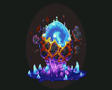
  </a>

<h3 align="center">Ryu Staking Contracts</h3>

  <p align="center">
    The Smart-Contracts of RyuGen2 Staking
    <br />
    <br />
    <a href="https://ryunft.com" target="_blank">View Live Version</a>
    ·
    <a href="https://marketplace.kalao.io/collection/0x13d933eb47f41cbc0687376622d03a8da10feab6" target="_blank">Ryu Collection</a>
    ·
    <a href="https://marketplace.kalao.io/collection/0xa9de371071e96e2c9e3a907e5c561a6738302eb1" target="_blank">RyuGen2 Collection</a>
    ·
    <a href="https://marketplace.kalao.io/collection/0x994afdf17f6ae877986d1e6791819c36a6e12ff4" target="_blank">Ryusaur Collection</a>
  </p>
</div>


<!-- TABLE OF CONTENTS -->
<details>
  <summary>Table of Contents</summary>
  <ol>
    <li>
      <a href="#about-the-project">About The Project</a>
      <ul>
        <li><a href="#built-with">Built With</a></li>
      </ul>
      <ul>
        <li><a href="#ryu-gen1">Ryu Gen1</a></li>
      </ul>
      <ul>
        <li><a href="#nryu">$nRyu</a></li>
      </ul>
      <ul>
        <li><a href="#ryu-gen2">Ryu Gen2</a></li>
      </ul>
      <ul>
        <li><a href="#architecture">Architecture</a></li>
      </ul>
    </li>
    <li><a href="#breeding">Breeding</a></li>
    <li>
      <a href="#potions">Potions</a>
      <ul>
        <li><a href="#speed-up">Speed-up</a></li>
        <li><a href="#strip-down">Strip-Down</a></li>
        <li><a href="#fraternal-twins">Fraternal Twins</a></li>
        <li><a href="#identical-twins">Identical Twins</a></li>
      </ul>
    </li>
    <li>
      <a href="#getting-started">Getting Started</a>
      <ul>
        <li><a href="#prerequisites">Prerequisites</a></li>
        <li><a href="#installation">Installation</a></li>
      </ul>
    </li>
    <li>
      <a href="#usage">Usage</a>
       <ul>
        <li><a href="#scripts">Scripts</a></li>
      </ul>
    </li>
    <li><a href="#test">Test</a></li>
    <li><a href="#contact">Contact</a></li>
  </ol>
</details>


<!-- ABOUT THE PROJECT -->
## About The Project

This repository contains the contracts used for the staking of the RyuGen2 collection.<br>
These are EVM compatible.<br>

<p align="right">(<a href="#readme-top">back to top</a>)</p>

### Built With

<br>
<p align="left">
  <a href="https://hardhat.org" target="_blank"> 
    
  </a>
  <a href="https://mochajs.org" target="_blank"> 
    
  </a>
  <a href="https://chaijs.com" target="_blank"> 
    
  </a>
</p>
<p align="right">(<a href="#readme-top">back to top</a>)</p>

<!-- Ryu Gen1 -->
## Ryu Gen1
<div align="center">
  
</div>
<br>
Ryu NFT is a collection of ERC721 tokens available on the Avalanche blockchain.<br>
This one has already realized more than 10 000 $AVAX volume.<br>

#### Tokenomics 
The collection <strong>sold out</strong> at <strong>3333 NFT</strong>, the mint price was <strong>2.22 $AVAX</strong>.
<br>

#### Description 
Gen1 dragons include 3234 base and 99 legendary which can breed and be staked for daily $nRyu.<br>
By staking their Ryu Gen1 users can generate $nRyu.

<a href="https://marketplace.kalao.io/collection/0x13d933eb47f41cbc0687376622d03a8da10feab6" target="_blank"> 
  🛒 Check the collection on Kalao
</a>

<p align="right">(<a href="#readme-top">back to top</a>)</p>

<!-- $nRyu -->
## $nRyu
<div align="center">
  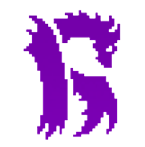
</div>
<br>
$nRYU is the Gen1 staking rewards token. It's an ERC20 token.<br> 

#### Tokenomics 
$nRYU has a hard cap supply of <strong>130,000,000 tokens</strong>. 
<div align="center">
  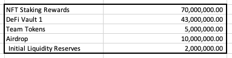
</div>
<br>

#### Description 
The $nRYU token can be utilized on Breeding, Potions acquisitions, Gen2 Prestige system, and more.

<a href="https://snowtrace.io/token/0x0FC468c8E2003C0e6Ab0e60DBf02b01ce27B4c7f" target="_blank"> 
  🔍 Check the token on Snowtrace
</a>

<p align="right">(<a href="#readme-top">back to top</a>)</p>

<!-- Ryu Gen2 -->
## Ryu Gen2

<div align="center">
  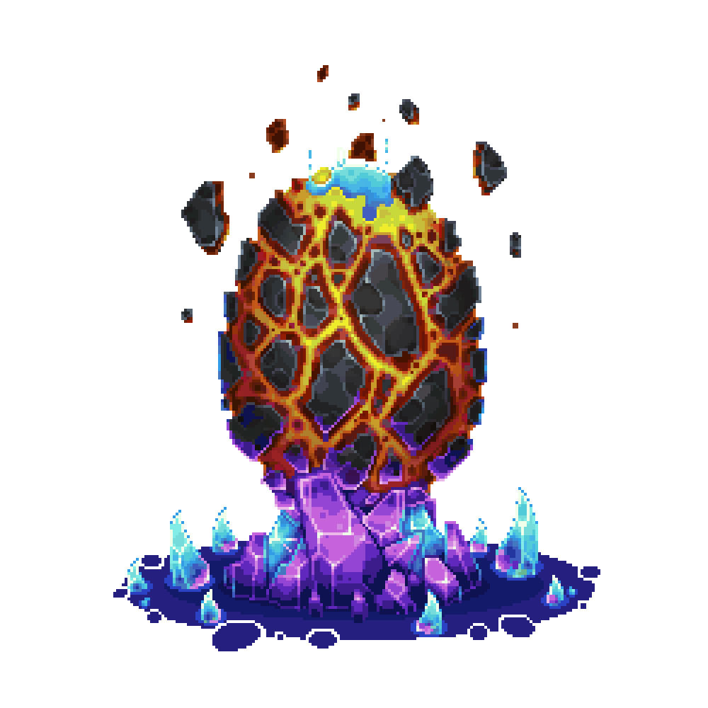
</div>
<br>
RyuGen2 is a collection of ERC721 tokens available on the Avalanche blockchain.<br>
These tokens are only obtainable by breeding Ryu Gen1 tokens or by using potions from the lab.<br>

#### Tokenomics 
The collection is capped at <strong>9999 NFT</strong>.
<br>

#### Description 
Ryu Gen2 is the first generation of offspring in the Ryu Ecosystem. Stake these NFTs to earn $nRyu.

<a href="https://marketplace.kalao.io/collection/0xa9de371071e96e2c9e3a907e5c561a6738302eb1" target="_blank"> 
  🛒 Check the collection on Kalao
</a>


<p align="right">(<a href="#readme-top">back to top</a>)</p>

<!-- Ryusaur -->
## Ryusaur

<div align="center">
  
</div>
<br>
Ryusaurs (DINOs) were launched as a free mint on KalaoGo. Unlike most free mints from this time, this NFT bears actual utility.<br>

Ryusaurs function most similarly to the Gen2 Staking Potions, but without the expiration date.

#### Tokenomics 
The collection is capped at <strong>999 NFT</strong>.
<br>

<a href="https://marketplace.kalao.io/collection/0x994afdf17f6ae877986d1e6791819c36a6e12ff4" target="_blank"> 
  🛒 Check the collection on Kalao
</a>


<p align="right">(<a href="#readme-top">back to top</a>)</p>

<!-- Description -->
## Description
This staking contract does not work like the usual staking contracts.

Indeed this one works with a system of level and tier and will thus incite the users to climb these.

Each level will allow the user to obtain **greater returns**.

In addition to this level and tier mechanics it will also be possible to boost the emissions of its NFT thanks to the staking of other collections: Ryusaurs and Ryu Gen1.

This contract also manages the specificities of Ryu Gen2 NFT's

This contract has been designed to **maximize** the use of the different collections and the $nRyu token while allowing to **track its issue**.

Indeed by joining a Ryusaur or a RyuGen1 to his RyuGen2 staking you get a **token emission boost**.

The contract also allows you to retrieve a leaderboard of levels and ranks obtained that will **create community engagement**

The token $nRyu is no longer mintable and the contract will have to be fed manually by the creator by sending the tokens on it.

<p align="right">(<a href="#readme-top">back to top</a>)</p>

<!-- Maths -->
## Maths

All costs, earnings, emissions and cap are expressed in $nRyu.

### Cost to go from one level to the next

Each level change is subject to a **cost** which is defined by the following function:

$$
\begin{align*}
f(x) = 1.36 * level + 2.05
\end{align*}
$$

This gives us the following table which is **not dependent on the tier**:

<div align="center">
  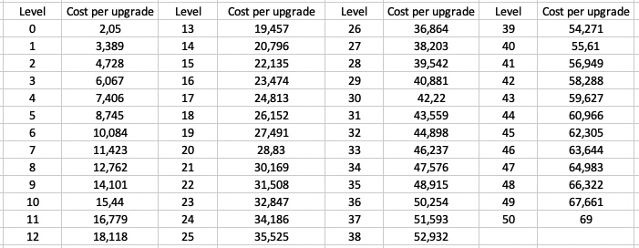
</div>

### Emission/day per level and tier

Each level passage also allows the token to **increase** its emissions per day, its emissions are defined by the following function:

$$
\begin{align*}
f(x) = 0.216334 * level + K \\
tier 1 : K = 0.6833 \\
tier 2 : K = 2.1833 \\
tier 3 : K = 3.6833 \\
\end{align*}
$$

This give us the followings tables : 

#### Emission Tier 1

<div align="center">
  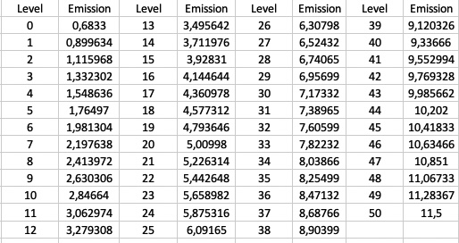
</div>

#### Emission Tier 2

<div align="center">
  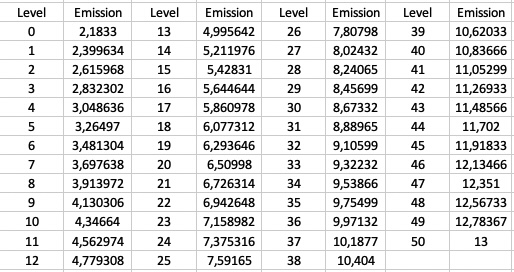
</div>

#### Emission Tier 3

<div align="center">
  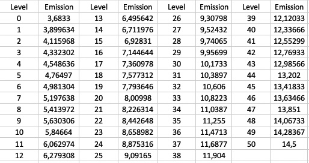
</div>

### Emission Cap

Each passage of level thus also allows the token to **increase** its cap of emission (maximum of gained token), this one is defined by the following function:

$$
\begin{align*}
f(x) = 1.4729 * level + K \\			
tier 1 : K = 0.6833 \\
tier 2 : K = 4.4375 \\
tier 3 : K = 8.18125 \\
\end{align*}
$$

By calculating the sum of the terms of this sequence, we obtain the total gain per NFT of : 7117,98075 $nRyu

The number of tokens distributed will therefore be obtained via the function :

$$
\begin{align*}
f(x) = 7117.98075 * RyuGen2Supply
\end{align*}
$$

#### Emission Cap Tier 1

<div align="center">
  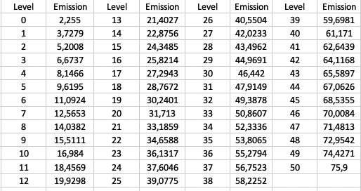
</div>

#### Emission Cap Tier 2

<div align="center">
  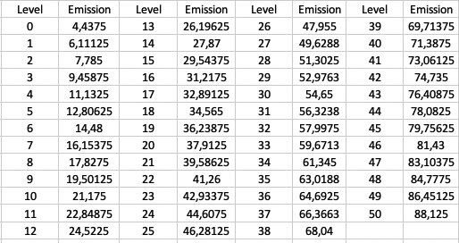
</div>

#### Emission Cap Tier 3

<div align="center">
  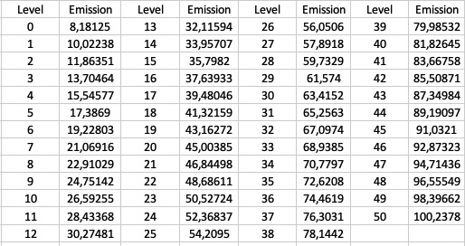
</div>

<p align="right">(<a href="#readme-top">back to top</a>)</p>

<!-- GETTING STARTED -->
## Getting Started

To get a local copy up and running follow these simple example steps.

### Prerequisites

* npm
  ```sh
  npm install npm@latest -g
  ```
* hardhat
  ```sh
  npm install hardhat
  ```

### Installation

1. Clone the repo
   ```sh
   git clone https://github.com/YassineSMARA/ryu-breeding-contracts.git
   ```
2. Install NPM packages
   ```sh
   npm install
   ```
3. Enter your PRIVATE_KEY in `.env.example and rename the file to `.env`
   ```env
   PRIVATE_KEY=ENTER_YOUR_PRIVATE_KEY
   ```

<p align="right">(<a href="#readme-top">back to top</a>)</p>

<!-- USAGE EXAMPLES -->
## Usage
Try running some of the following tasks:

```shell
npx hardhat accounts
npx hardhat compile
npx hardhat clean
npx hardhat test
npx hardhat node
npx hardhat help
REPORT_GAS=true npx hardhat test
npx hardhat coverage
npx hardhat run scripts/deploy.ts
TS_NODE_FILES=true npx ts-node scripts/deploy.ts
npx eslint '**/*.{js,ts}'
npx eslint '**/*.{js,ts}' --fix
npx prettier '**/*.{json,sol,md}' --check
npx prettier '**/*.{json,sol,md}' --write
npx solhint 'contracts/**/*.sol'
npx solhint 'contracts/**/*.sol' --fix
```

<!-- Test -->
## Test

<div align="center">
  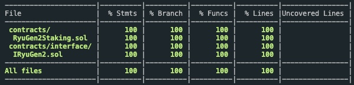
</div>

<p align="right">(<a href="#readme-top">back to top</a>)</p>

<!-- CONTACT -->
## Contact

Yassine SMARA <br>
Discord: Krabs#9454 <br>
Mail: 1yassine.smara@gmail.com

<p align="right">(<a href="#readme-top">back to top</a>)</p>
